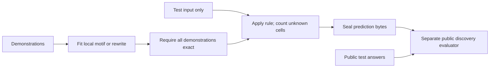

# Local grid rules: a bounded ARC2 discovery experiment

The new original local-rule family solves **1 of 172 public test outputs**,
versus zero for our earlier whole-grid grammar. That answer is already solved
by the fixed reference recipe, so **unique incremental outputs and deployable
fill-only improvements both remain zero**. This method should not be promoted.

This is an **already-exposed public discovery set**, not held-out evidence.
We inspected demonstration geometry before fixing the new grammar: 81 of 120
tasks preserve dimensions across every demonstration, so whole-grid crop/
orientation programs miss an important class of local changes.

| Actual measurement | New local rule family | Fixed reference |
|---|---:|---:|
| Exact public outputs / 172 | 1 | 45 |
| Fully solved public tasks / 120 | 1 | 30 |
| Tasks with exact demonstration fit | 15 | Not measured here |
| Unique correct outputs beyond reference | 0 | — |
| Prediction CPU time | 0.440171 s | Existing frozen artifact |
| Maximum observed task time | 0.031998 s | — |
| Task timeouts | 0 | — |

## Original method

Two finite families were independently implemented:

1. Match fixed small motifs (cross, square, line, L, T, X or ring) of one
   source color and recolor all matched motif cells. The source/target pair
   must be the single change pair observed across demonstrations.
2. Learn local color-relative rewriting rules. Neighborhoods encode color
   equality relative to center/background. For every repeated demonstration
   signature, intersect actions that could produce its observed target:
   copy center, copy background, copy a neighbor, or a fixed output color.
   Conflicting signatures reject that configuration. Unseen signatures copy
   the input and their counts are reported.

The grammar has six local configurations and a finite motif list. All grids
are bounded to 30×30, with cooperative two-second task and 90-second whole-run
budgets. The measured run finishes far below those limits. No task identifier,
file path, reference prediction or test answer reaches the solver. Every
accepted rule must reproduce all demonstrations exactly.

The sole correct public prediction is a recolored five-pixel cross. Its motif
rule has no unknown cells; the local-lookup alternative does. Other fitted
programs leave between 42 and 839 test cells unseen in at least one selected
output. Exact demonstration fit alone does not establish generalization.

Six invented controls passed: translated/resized cross, square, line and L
motifs with an unrecolored distractor; forbidden test-truth rejection before
abstention; and a 31-column grid rejection. These validate mechanics, not
benchmark quality.

## Reproduction and evidence

`run_predictions.py` accepts only a challenge path and a new output path.
It writes a source/config seal before prediction and a byte seal afterward.
`evaluate.py` checks those seals before opening public solutions and the fixed
reference. All writes use exclusive creation; use a fresh copied study
directory for a rerun. Existing study files and all notebook artifacts remain
preserved. No external API, GPU, notebook push or submission was used.

The recorded evaluator uses the existing campaign's local public inputs.
Adapt its three file-path constants to your own permitted local copies before
starting a new study. Do not copy third-party datasets into the code package.

Original new source and documentation: MIT. Public ARC-AGI-2 data belongs to
its original authors and retains its original terms; the frozen reference is
from the credited `rokaiyasomapti/reproduce-nvarc-2025-results` V2 recipe.
This package does not include competitor code, checkpoint or raw task data.

The public set was already exposed; hashes establish reproduction integrity,
not historical non-exposure or hidden leaderboard improvement. Further work
needs richer relational object rules and an independent confirmation set.
