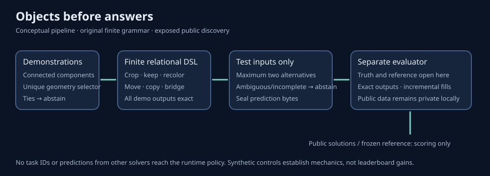

# A finite object grammar that finds its limits

This original ARC2 experiment checked **4,696,960 programs** across all 120
already-exposed public tasks and 172 test outputs. It found **zero programs that
fit every demonstration**, produced zero answers, and added zero correct
outputs to the frozen reference. Do not promote this grammar as a score upgrade.

| Recorded measurement | Object DSL | Frozen reference |
|---|---:|---:|
| Exact public outputs / 172 | 0 | 45 |
| Fully solved tasks / 120 | 0 | 30 |
| Unique incremental outputs | 0 | — |
| Deployable fill-only improvements | 0 | — |
| Prediction CPU time | 18.739859 s | Existing artifact |
| Prediction wall time | 22.148616 s | Existing artifact |
| Maximum recorded task CPU time | 0.355782 s | — |
| Timed records | 120 | — |
| Task timeouts | 0 | — |

The reference's fractional credit is exactly `197/6` across 120 tasks,
or `197/720` mean task credit. These are local public-discovery measurements,
not official submission scores. The reference was already exposed and remains
unchanged; the source/configuration was fixed before this experiment's separate
evaluator opened the solutions.

## What the grammar actually does

The solver segments grids under eight fixed configurations: a unique modal or
zero background, four- or eight-neighbor connectivity, and monochrome or all
foreground components. Sixteen selectors choose objects by unique geometry,
color/shape uniqueness, or bounding-box containment. A tie abstains rather than
using component discovery order.

Programs crop and orient an object, keep or erase it, recolor it, crop a pair,
move or copy it relative to another object, or bridge two aligned object centers.
Containment refers to bounding boxes. Translation checks grid bounds and rejects
collisions with other foreground pixels. Recoloring includes absolute constants
that must fit the demonstrations, plus another object's color.

There are 5,248 programs per segmentation and at most 41,984 checks per task.
Every fitted program must reproduce every demonstration output exactly. Test
grids influence applicability and ambiguity only. If more than two distinct
whole-task prediction bundles survive, the solver abstains on the entire task.
An incomplete search also abstains. Counts can be partial after those early exits.
No such exits occurred in the measured public run.

The 1.2-second task and 165-second whole-run CPU budgets are cooperative;
unchecked sections can overrun an individual deadline. The runner also installs
a 180-second process CPU resource limit on Unix. Every public task has a timing
record. These limits constrain this study and do not establish production
performance on arbitrary input streams.

## Invented controls, rather than task memorization

Eleven checks passed. They include largest-object cropping after translation and
canvas enlargement; a palette permutation that changes the background;
copying a small object next to a larger anchor across changed colors and canvas
size; extending a bridge across a new distance; tied-selection abstention; and
forbidden truth/identifier and malformed-grid rejection.

These are useful mechanics tests. The complete solver is not guaranteed palette
equivariant because it includes a zero-background branch and absolute recolor
constants. Successful synthetic controls do not establish public or hidden
benchmark performance.

## Reproduce safely

The package uses the Python standard library. Run the invented controls with
`python3 -B positive_controls.py`. The output file must be absent; all study
writes use exclusive creation. Use a new experiment directory for another run,
keeping prior source, seals and results intact.

For the exact public experiment, run `run_predictions.py` with `--challenges`
and a new `--output` path. It accepts no solutions or reference argument. The
challenge hash is pinned to the recorded public cohort. To study another
permitted cohort, create an explicitly new source copy and adjust the declared
hash before creating the source seal; never describe that new run as the old one.

Then run `evaluate.py` with `--predictions`, `--solutions`, `--reference` and a
new `--output` path. The evaluator verifies sealed prediction bytes and all five
pinned source/configuration files before opening solutions or the reference.
Actual datasets and reference predictions are deliberately excluded from this
package. Its scalar summary contains their hashes for precise reproduction.

The runner strips identifier/test-output extras before calling the solver. The
solver's exact contract rejects those keys. Task identifiers are private join
keys in the evaluator only. Deduplicated reference attempts retain their order;
original attempts enter free slots only, up to two. Oracle union is reported as
an upper bound and cannot be deployed using answer truth.

Unsigned seals bind current bytes. They do not independently prove historical
non-exposure or chronology. No Kaggle API, GPU/TPU run, official submission,
notebook mutation or external publication was performed by this study.

## What this failure tells us

The absence of demonstration fits occurs before test-output selection. Improving
the candidate ranker cannot rescue a grammar with no explanatory programs.
Useful successors need richer composition, object correspondence or learned
program proposals. That is a hypothesis for a new frozen study, not a result
established here. Existing notebooks and source history remain preserved.

Original source, controls, diagram and documentation are MIT. See `NOTICE.md`
for the separate public-data and credited-reference scope.
