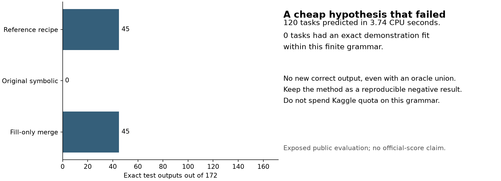
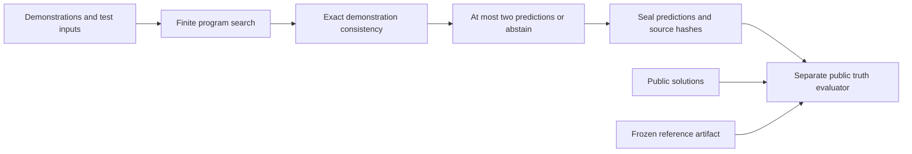

# A four-second ARC2 experiment that failed usefully

Our original, finite symbolic supplement solved **0 of 172 public test outputs**
across all **120 public ARC-AGI-2 evaluation tasks**, in **3.744 seconds** of local
CPU prediction. It found no program that exactly matched the demonstrations of
any of these tasks. The fixed reference recipe solved 45 outputs. Adding our
method produced no gain, even with an oracle that could select either method.
Do not spend Kaggle quota on this grammar or present it as an improvement.



| Public measurement | Reference recipe | Original symbolic | Fixed fill merge |
|---|---:|---:|---:|
| Exact test outputs / 172 | 45 | 0 | 45 |
| Fully solved tasks / 120 | 30 | 0 | 30 |
| Fractional task credit / 120 | 32.833333 | 0 | 32.833333 |
| Mean fractional task credit | 27.361111% | 0% | 27.361111% |

Fractional credit gives each task total weight one, shared equally across its
test outputs. It is different from the percentage of exact outputs and from
the number of fully solved tasks. These numbers come from exposed public data
and a frozen reference artifact, **not a competition submission**.

## What was tested

The solver searches a deliberately small, interpretable grammar: D4 orientations,
foreground or color crops, uniquely largest/smallest connected components,
equal-panel Boolean combinations, fixed 1–3 scaling or tiling, and a color map
consistent across every demonstration. It returns the first two distinct
predictions by fixed program cost, or abstains. A stricter alternative requires
every fitted program to agree. Neither variant yields a fitted program here.



The solver takes no task identifier, file path, model, reference artifact or test
solution. Task IDs key the outer prediction file only. The public evaluator opens
solutions in a separate process after the prediction seal was written. The seal
is a reproducibility hash, not a cryptographic proof of historical non-exposure.
The study's programmer and campaign have already worked with public evaluation
information; this must not be described as an untouched benchmark.

Nine initial CPU checks and seven invented generalization controls passed. An
independent reviewer re-ran all 120 tasks and the evaluator, reproducing the
substantive predictions and evaluation exactly. They found a validation-order
defect on tasks with fewer than two demonstrations: V1 could abstain before
rejecting forbidden nested keys. Every measured task has 2–6 demonstrations,
so it does not change this result. V2 fixes that input validation only; V1,
its seal, and its result remain preserved. Six V2 contract checks passed.

## Reproduce the actual study

Only Python's standard library is needed for prediction/evaluation. Matplotlib
is optional for the figure. Supply your own permitted local copies of the
public challenge/solution files and the attributed reference artifact.
The commands require new output names and refuse to overwrite earlier results.

```bash
python3 predict_challenges.py \
  --challenges /absolute/path/arc-agi_evaluation_challenges.json \
  --output /absolute/path/new_public_predictions.json

python3 evaluate_sealed.py \
  --predictions /absolute/path/new_public_predictions.json \
  --solutions /absolute/path/arc-agi_evaluation_solutions.json \
  --reference /absolute/path/rokaiya_v2_submission.json \
  --output /absolute/path/new_public_evaluation.json
```

The historical reproduction runner uses preserved V1. New integration should
use `symbolic_supplement_v2.py`; its only delta is validation ordering. No
notebook integration or external run was made by this research workstream.

## The next question should change candidate coverage

The existing V13 neural-pool study found the true output anywhere in only one
of thirteen output pools, already at the top rank. A better selector cannot
repair the other twelve misses. Our simple symbolic alternative does not repair
them either. This does not show that richer program synthesis is hopeless.

One missing controlled comparison is **DFS cutoff 20% versus 9%** under equal
compute, the same checkpoint, adaptation, views and selector. The credited
recipe sets `max_score = -log(0.2)`; the original
[ARChitects paper](https://arxiv.org/html/2505.07859v1) reports a 9% cutoff.
That paper's result is on ARC-AGI-1 and cannot establish an ARC-AGI-2 gain.
`NEXT_EXPERIMENT.json` fixes the scientific question, controls, metric and
promotion limits. It is an unexecuted protocol for the campaign coordinator.
Use new public-training development tasks and task-disjoint confirmation,
rather than selecting our already inspected evaluation failures.

Current public notebooks mostly expose the same 4B Qwen/LoRA recipe; the
[NVARC authors](https://github.com/1ytic/NVARC) describe synthetic data,
ARChitects, and recursive models as distinct parts of their original solution.
Do not infer that a rerun of one public notebook reproduces every winning
component, or that the current highest-scoring private team has published its
method. The live Kaggle page did not expose a leaderboard table to the text
reader during this audit. Indexed search results were four weeks old and were
not accepted as current standings.

Another primary-paper caution: the abstract of
[Multi-Perspective Transformers](https://arxiv.org/html/2605.01154v1) mentions
21.7% evaluation accuracy, but its Table 2 assigns that to the pretrained
baseline; its TTT/PoE combinations report zero. It therefore does not support
an inference-time improvement claim for those settings.

## Credits and license

New implementation and documentation: original work for `cubres`, MIT.
Public dataset: François Chollet / ARC Prize Foundation; upstream
[ARC-AGI-2 repository](https://github.com/arcprize/ARC-AGI-2) lists Apache-2.0
and warns against repeated evaluation tuning. The frozen reference artifact
is from `rokaiyasomapti/reproduce-nvarc-2025-results` V2 and the NVARC recipe.
Its code, checkpoints and external dependencies retain their actual separate
terms. This packet includes no checkpoint or raw challenge/solution dataset.
See `NOTICE.md`.
