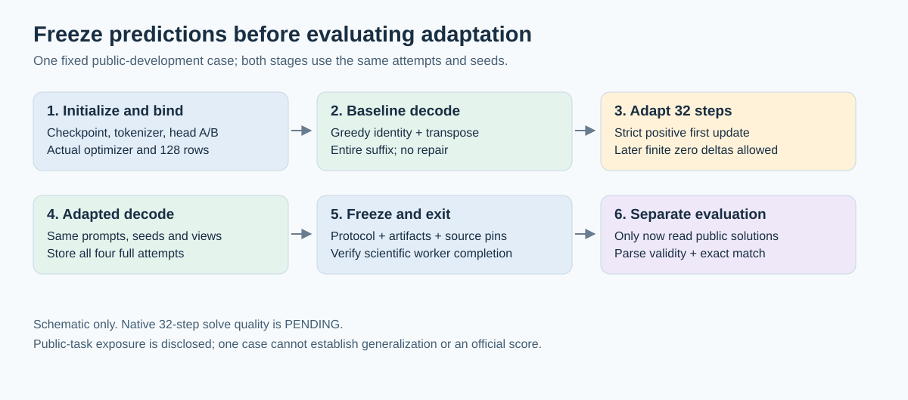
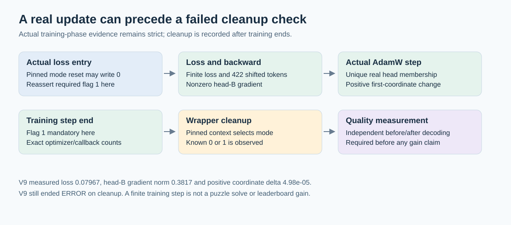

# From a real head update to a measurable decoding experiment

The first useful result was getting the actual training path to work. On 7 October, one native Trainer step produced a finite loss, a nonzero output-head adapter gradient and a positive AdamW update. The diagnostic still ended in **ERROR**: its post-training cleanup assertion demanded a flag value that the pinned wrapper does not universally guarantee.

That distinction matters. A working update is necessary for adaptation, but it does not tell us whether adaptation solves a puzzle. The next experiment compares fixed baseline and adapted outputs; its quality result is **PENDING**. The first launch attempt was rejected by Kaggle's two-session GPU batch capacity limit. A later request was accepted and was explicitly RUNNING at 22:40 UTC on 7 October. No competition submission was created.

## What actually ran

| Measurement | Native one-step observation |
|---|---:|
| Actual Trainer loss | 0.0796700045466423 |
| Shifted supervised tokens | 422 |
| Head-B gradient norm | 0.38172560930252075 |
| Head-B maximum absolute gradient | 0.047119140625 |
| Positive head-B coordinate change after actual AdamW | 0.00004982948303222656 |
| Actual AdamW pre/post callbacks and global step | 1 / 1 / 1 |
| Whole diagnostic | **ERROR: post-training cleanup flag contract** |
| Puzzle quality / completed official score | **Not established by this run** |

The recorded change is one gradient-selected coordinate's absolute difference. It is not a complete parameter diff, proof of 32 positive updates, or a solve result. No held solution file was opened by this one-step diagnostic. `aggregate-evidence.json` contains the sanitized measurements and evidence hashes; private notebook identities, execution URLs, token arrays and parameter probes are excluded.

## Why the cleanup assertion failed

The pinned Unsloth training wrapper remembers the model's previous mode and restores the corresponding mode after training. `for_training` writes `UNSLOTH_RETURN_LOGITS=0`; `for_inference` writes `1`. Therefore the post-wrapper value is context dependent.

The corrected contract keeps flag 1 mandatory at the actual loss entry, within/after the loss, and after the actual optimizer step while training is active. It records a known cleanup value of 0 or 1 outside training, without restoring the flag to manufacture success. An unknown cleanup value still holds the run. The known first nonzero head-B gradient, unique actual optimizer membership and positive update gates remain strict.

## The fixed next experiment

One previously exposed public-development case, `3dc255db`, is preregistered. It uses the same 128 original augmented rows, augmentation seed 1 and training/decode seed 42. The neural configuration retains rank-256 adapters, alpha 32, AdamW at 0.00005 and cosine scheduling. The diagnostic warmup ratio is zero; the original full training recipe's 0.1 warmup is a different schedule.

Both baseline and adapted stages use greedy identity and transpose attempts, EOS 15, pad 13 and a 930-token suffix cap. There is no suffix trimming or repair. All four outputs and the source/protocol hashes must be frozen before a separate evaluator reads public solutions. Same-model initialization, zero head B, disjoint adapter storage, canonical tokenizer and actual optimizer membership checks precede any decode. Step 1 remains strict; later finite gradients and deltas may legitimately be zero.

This is a one-case development check, not blinded task selection or a benchmark. Earlier canaries exposed this task's training pairs, and the external checkpoint's public-task exposure is unknown. Even a later exact solve on this case will not establish generalization or a leaderboard improvement.

The private scientific candidate is prepared and independently source reviewed. The later native quality execution was accepted and was explicitly RUNNING at 22:40 UTC on 7 October; no terminal prediction or solve-quality evidence has been collected yet. The service rejected its first save request with `Maximum batch GPU session count of 2 reached.` A subsequent fresh full pull showed the existing version and source unchanged. This was a service capacity limit, not a notebook-preservation rejection.

## Reproduce the method without repackaging the data

The [original source-only harness](../../tools/publicdev-ttt/2026-10-07/README.md) provides a runnable synthetic demonstration, a strict token parser, source-pinned prediction freezing, separate evaluation, and a small engine interface. It does **not** include the private neural driver, framework setup files, model weights, public solution files, or task grids. Its toy demo validates orchestration only. A real engine must supply its own independently reviewed initialization/backward/optimizer evidence.

Obtain the inputs and dependencies from their authors:

- [Official Kaggle challenge data](https://www.kaggle.com/competitions/arc-prize-2026-arc-agi-2/data).
- [Sorokin's Qwen3 grid checkpoint, version 1](https://www.kaggle.com/models/sorokin/qwen3_4b_grids15_sft139/transformers/bfloat16/1).
- [Konstantin Boyko's pinned Unsloth 2026.7.2 / Torch 2.10 CUDA setup](https://www.kaggle.com/code/konstantinboyko/unsloth-2026-7-2-torch-2-10-0-cu128-patched).
- [The corresponding Flash Attention wheel dataset](https://www.kaggle.com/datasets/konstantinboyko/whl-flash-attn-2-8-3).

The neural recipe also follows the original NVARC/Qwen authors and the credited `koushikrudra/failed-in-aimo` notebook lineage. This release does not copy that loader/training implementation. Dependency licenses and access conditions remain separate from the original Apache-2.0 harness. `reproduction-pins.json` records exact source/data/tokenizer/configuration identifiers rather than redistributing those materials.
