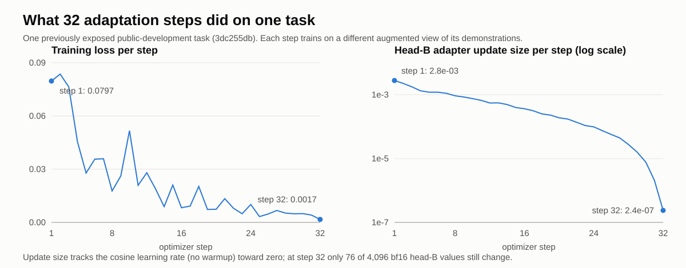

# 32 adaptation steps on one task: the decode changed, the answer did not

This is the terminal result of the fixed before/after experiment described in [the 7 October note](../2026-10-07-native-head-update/README.md). On 8 October the full protocol ran end to end for the first time. It completed 32 real optimizer steps on a single, previously exposed public-development task (`3dc255db`). Both stages produced valid grids, and the predictions were frozen before a separate evaluator read the public solution. **None of the four outputs is an exact solve, before or after adaptation.** No competition submission was created.

The first attempt at this experiment stopped before training. The Unsloth version we pin defaults `for_training(model)` to gradient checkpointing on. That call switched checkpointing on for every decoder layer, but no checkpoint function had ever been installed, so the first training forward raised `AttributeError: 'Qwen3DecoderLayer' object has no attribute '_gradient_checkpointing_func'`. The rerun passes `use_gradient_checkpointing=False` at both mode switches, matching how the model was loaded, adapted and configured. It also restores the logits flag before the adapted decode, because the pinned `train()` wrapper leaves it at 0. Nothing else in the protocol changed.

## What ran

| Measurement | Value |
|---|---:|
| Actual optimizer steps (AdamW pre/post hooks, callbacks, global step) | 32 / 32 / 32 / 32 |
| Loss at step 1 (identical to the 7 October one-step run) | 0.07967 |
| Loss at step 32 | 0.00167 |
| Mean training loss over 32 steps | 0.0219 |
| Supervised tokens per step | 422 |
| Head-B gradient norm, step 1 / peak (step 12) / step 32 | 0.382 / 0.886 / 0.028 |
| Head-B update norm, step 1 / step 32 | 2.8e-3 / 2.4e-7 |
| Head-B values that still change at step 32 | 76 of 4,096 |
| Fraction of one epoch covered by the 32 steps | 0.25 |
| Valid grids (before / after) | 2 of 2 / 2 of 2 |
| Exact solves (before / after) | 0 / 0 |

The loss fell about 48-fold, but it is training loss on the task's own demonstration pairs, and every step uses a different rotation, transposition and colour permutation of them. That explains the jagged curve. Low loss shows the adapters fit the demonstrations. It does not show they generalize to the held-out test input.

The update size shrinks because of the schedule, not because training converged. The cosine learning rate decays to almost zero over 32 steps with no warmup. The per-step change of the largest head coordinate tracks the learning rate (about 5e-5 at step 1). By the last few steps most updates are smaller than bf16 can represent at these weight magnitudes, so the final steps barely move the head.

## Did adaptation change the predictions?

Yes, slightly. Compared token by token, the adapted greedy decode differs from the baseline in 2 of 168 positions for the identity attempt and in 7 of 169 for the transpose attempt. Every output ended in EOS with the correct shape.

As a post-hoc check, outside the preregistration, we compared the frozen outputs with the public solution cell by cell. The baseline missed 4 of 156 cells in both attempts. After adaptation the identity attempt missed 2 and the transpose attempt missed 5. One attempt moved closer and the other moved further away, so this single case does not show a consistent effect.

## Timing

The whole run took 362 s against an 1800 s cap. The scientific worker took 123 s:

| Phase | Time |
|---|---:|
| Model load and setup | about 38 s |
| Two baseline decodes | 26 s |
| 32 training steps (1.16 s per step; the decode prompt is about 1,040 tokens and training rows are similar) | 37 s |
| Two adapted decodes | 22 s |

The evaluator ran in under one second. Both owned process groups were torn down cleanly. `timing.json` has the sanitized numbers.

## What would actually answer the question

One task cannot show that test-time adaptation helps. The next step is a preregistered panel of public-development tasks run with this same protocol:

- Choose the tasks by a salted hash before running anything.
- For each task, record whether either attempt is exact, before and after adaptation.
- Count the tasks solved only after adaptation (b) and only before (c).

A one-sided sign test on b against c is the decision rule. With 24 tasks, b ≥ 5 and c = 0 (p ≈ 0.03) would support a gain, b ≤ c would count against one, and anything in between calls for a larger panel. A 24-task panel can detect only a large effect. Note also that this 32-step greedy protocol is much lighter than the full public recipe, which trains for a whole epoch and adds sampling and augmentation voting.

## Files

- `evaluation.json`: per-attempt validity and exact-match flags. It contains no grids and no ground truth.
- `science-completion.json`: per-decode token counts and timings, plus protocol and manifest hashes.
- `timing.json`: deadlines, phase timings and watchdog outcomes.
- `training-aggregates.json`: per-step loss, gradient norms and head-B update aggregates.
- `adaptation-steps.svg`: the figure above.

Prompts, token arrays, prediction grids, parameter values, private notebook identities and execution URLs are excluded. Each sanitized file records the sha256 of the raw receipt it came from.

Inputs and credits are the same as in [the 7 October note](../2026-10-07-native-head-update/README.md#reproduce-the-method-without-repackaging-the-data): the official Kaggle challenge data, Sorokin's Qwen3 grid checkpoint (Apache-2.0), the pinned Unsloth/Torch setup and Flash Attention wheels by Konstantin Boyko, and the NVARC/Qwen and `koushikrudra/failed-in-aimo` lineage of the training recipe.
