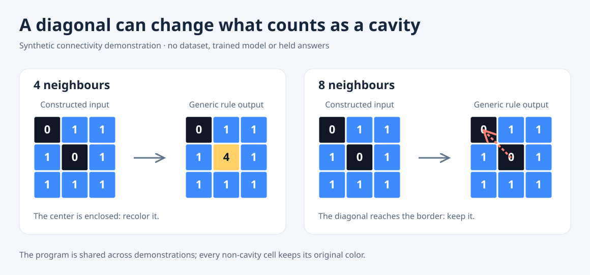

# Monochrome cavities: a small, inspectable ARC primitive

This original standard-library tool finds monochrome connected components
which do not touch the grid border. It can recolor those components directly,
or infer one shared adjacency/source-color/ink-color program from demonstrated
input/output pairs. Every other cell retains its original color.



The illustration is constructed from a 3×3 grid. It is a concept demonstration,
not a dataset example, trained-model prediction, or held-answer result. The
renderer calls the generic tool twice and emits deterministic SVG.

## Use

Python 3.10 or later is sufficient; there are no third-party dependencies,
model downloads, network calls or GPU requirements.

```python
from monochrome_cavities import enclosed_cells, recolor_enclosed

grid = [[0, 1, 1],
        [1, 0, 1],
        [1, 1, 1]]

assert enclosed_cells(grid, 0, adjacency=4) == frozenset({(1, 1)})
assert enclosed_cells(grid, 0, adjacency=8) == frozenset()
filled = recolor_enclosed(grid, 0, ink=4, adjacency=4)
```

The direct functions return immutable sets/grids. Inputs are never changed.
Grid colors must be built-in integers 0..9; booleans, floats, ragged arrays,
empty grids and dimensions above 30 are rejected. Adjacency is integer 4 or 8.

```python
from monochrome_cavities import fit_predict, fill_vacancies

ring = [[1, 1, 1], [1, 0, 1], [1, 1, 1]]
demonstrated = [[1, 1, 1], [1, 4, 1], [1, 1, 1]]
task = {
    "train": [{"input": ring, "output": demonstrated}],
    "test": [{"input": grid}],
}
result = fit_predict(task, cpu_seconds=0.20)
assert [c["program"] for c in result["candidates"]] == [[4, 0, 4], [8, 0, 4]]
guesses = fill_vacancies([], result["candidates"])
```

Both adjacency rules fit the ring demonstration, yet disagree on the diagonal
query. The tool retains both predictions rather than inventing confidence.
The query accepts **input only**. Fitting accepts 1..20 demonstrated pairs and
exactly one query; query-output fields and task-identity fields are refused.
Candidate colors come from fitting pairs alone. Unknown query colors are
preserved and cannot expand the grammar.

There are at most 180 programs: 2 adjacencies × at most 10 demonstrated source
colors × at most 9 different ink colors. A program must exactly reproduce
every fitting output and have non-empty changed-cell support on at least one
demonstration. Programs are ordered by adjacency, source color, then ink color;
identical joint query grids are deduplicated. A shape-changing task abstains.

`fill_vacancies` preserves the original parent prefix, including occupied slots,
then adds distinct grids until at most two guesses remain. It returns detached
JSON-compatible dictionaries; changing the result cannot change the inputs.
This policy guarantees no loss under the same exact-grid/top-two metric. It
does **not** establish accuracy or suitability beside a different neural pool.

## Budget and limitations

`cpu_seconds` is a finite positive **process CPU** budget. Checks are cooperative
and can overshoot between checks; they are not a wall-time/memory limit or a
security sandbox. The public wrapper checks after rendering/finalization and
can raise `TimeoutError` instead of returning a result after budget. Argument
validation is included. The frozen core also discards the whole family if
enumeration reaches its CPU cap, preventing a deadline-dependent prefix.

The component/search grammar and complete valid predictions are unchanged
from the retained study source. Public guards reject invalid inputs and add a
conservative finalization check. The byte-exact original remains available as
`reference_cavity_programs.py` for inspection; use the validated public API for
experiments. Do not assume a native Kaggle worker or submission integration.

## What the local experiment showed

A frozen, previously exposed panel of 100 publicly released ARC-AGI-2 training
tasks held out **training demonstration 0** from each task. A fresh common
parent pool used the remaining demonstrations. The cavity family filled vacant
slots only. Exact held-demonstration accuracy was **4/100 → 5/100**: one added
solve, no losses, 99 ties. The only added solve was `00d62c1b`, the same task
illustrated in the already-read ARC-DSL README. This is reference-example
recovery, not independent efficacy, a novel strategy validation, or an
official leaderboard improvement. Competition promotion remains **HOLD**.

All 100 parent searches completed; the cavity branch completed its grammar on
63 tasks and abstained for 37 shape-changing tasks. It enumerated 2,666 programs
in total, at most 180 on one task, and added one candidate. The whole local
study took 9.29 process CPU seconds on the recorded workstation. That timing
is not a promised speed on another environment.

The preparer parsed and quarantined held **training** outputs after freezing
the sources, task order and held index; it did not run the fitter. The separate
prediction worker received fitting pairs and held inputs only, denied target
reads, and sealed both prediction files. The separate evaluator verified both
seals before reading held training outputs. The worker hashed the actual staged
inputs; the evaluator checked their recorded hash binding. Opaque raw training
files were read for Git/SHA hashes; original query answers were never parsed
or used. No evaluation/private/test answer files were opened.

The study is preserved by source/receipt hashes in `provenance.json`. Training
grids, held targets, prediction grids, task panels, weights and submission
artifacts are not bundled here. The generic functions consume no task IDs.

## Verify and regenerate

```sh
python -B verify_synthetic.py
python -B render_connectivity.py --output fresh-connectivity.svg
```

The verifier uses an independent border-reachability oracle on all 512 binary
3×3 grids × 2 colors × 2 adjacency definitions, checks exact recoloring and
valid-source compatibility, and exercises invalid-input, ownership,
deduplication, ambiguity and finalization-deadline contracts. It reads only
the tool sources, not a dataset or experiment targets. Optimized-mode
verification is explicitly refused. The renderer creates a fresh SVG and
preserves existing files.

The current `VERIFICATION-v2.json` records 4,178 passing synthetic checks.
The earlier 4,177-check receipt and verifier are retained in
`historical/verifier-v1/`; the original top-level `VERIFICATION.json` also
remains intact. V2 requires an actual fitted candidate before checking that an
unknown query color remains unchanged. This strengthens the test without
changing the fitting implementation.

## Attribution

The component concept is informed by Michael Hodel's
[ARC-DSL README](https://github.com/michaelhodel/arc-dsl/blob/635de4902a5fb4e376f27333feaa396d3f5dfdcb/README.md),
pinned at commit `635de4902a5fb4e376f27333feaa396d3f5dfdcb` and released under
MIT. This implementation is original: no DSL implementation or solved-task
program was imported or copied. The newly authored tool is MIT licensed.
The unbundled official training data is separately Apache-2.0, pinned to
`arcprize/ARC-AGI-2` commit `f3283f727488ad98fe575ea6a5ac981e4a188e49`.
